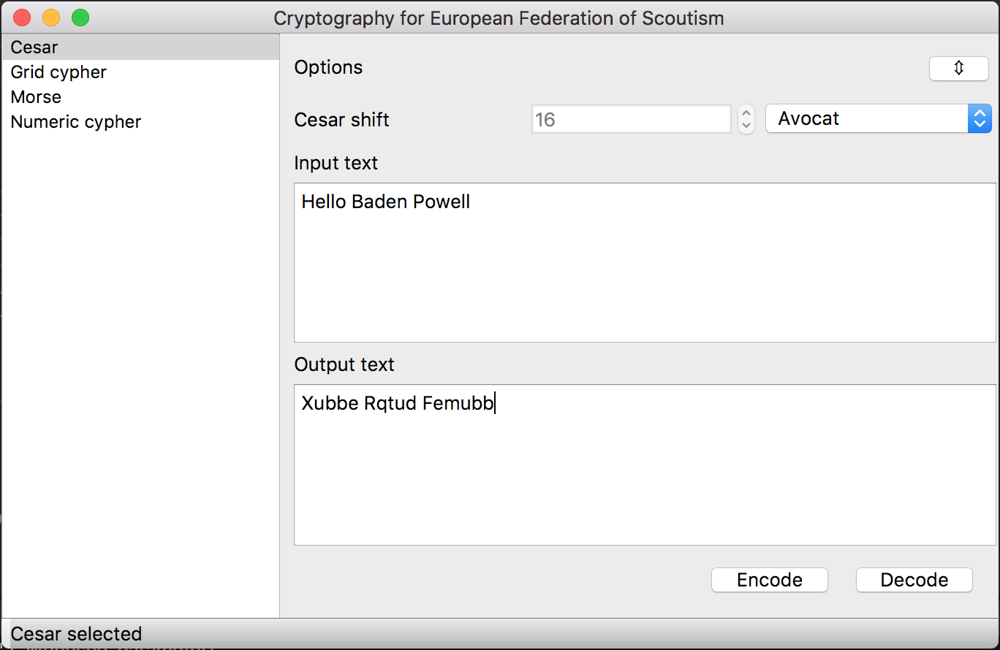

# AGSE Crypto

[](https://travis-ci.org/3wnbr1/Crypto)
[](https://ci.appveyor.com/project/3wnbr1/crypto)

Languages : [English](/Readme.en.md)

### Programme de cryptography scoute

> L'objectif est de permettre aux chefs d'unité de faire progresser leurs garçons/filles sans être des bêtes en cryptographie.
>
> Ewen BRUN - ACT troupe 1ère Notre Dame des Dombes



### Telecharger

OS          |  Lien
------------|------------------------
Windows x86 | Indisponible pour le moment
Windows x64 | [Version 0.1](https://github.com/3wnbr1/Crypto/releases/download/0.1/CryptorWin64.zip)
macOS x64   | [Version 0.1](https://github.com/3wnbr1/Crypto/releases/download/0.1/CryptorMac.zip)
Linux x86   | Indisponible pour le moment
Linux x64   | Indisponible pour le moment


### Installer

Vous pouver aussi compiler vous même :
```
git clone https://github.com/N0n3Typ3/Crypto.git
cd Crypto
mkdir build
cd build
qmake ..
make
```

### Contribuer

- Vous pouvez faire par de vos sugestions de nouveaux cryptages en non contactant par email.
- Vous pouvez egalement améliorer le projet en créant une nouvelle branche.
